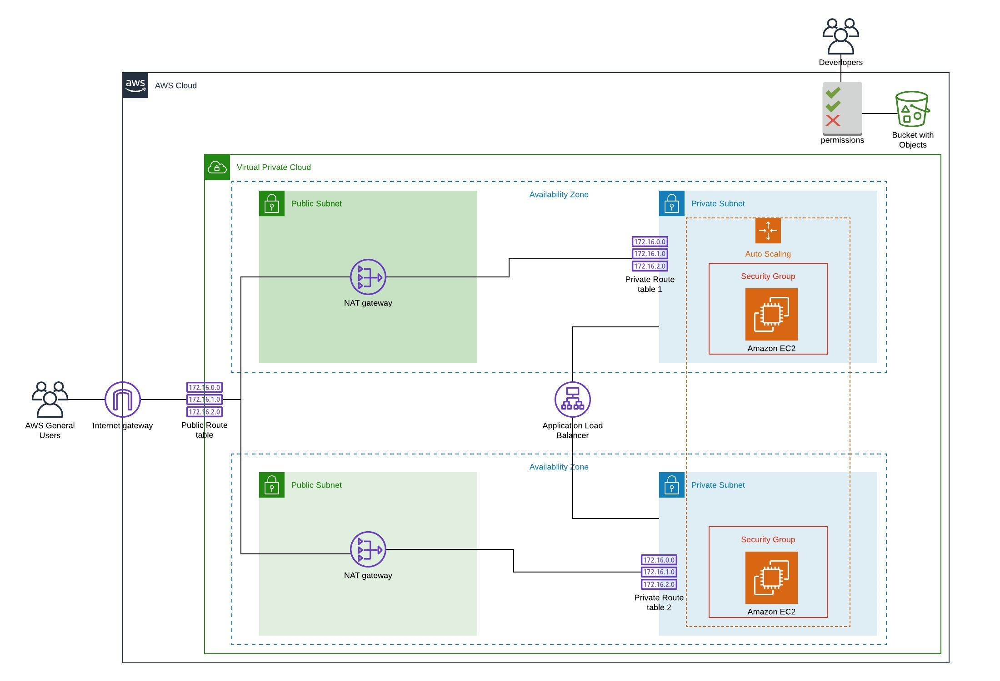

# Deploy a High-Availability Web App using CloudFormation

> This project demonstrates the deployment of web servers for a highly available web app using CloudFormation. It showcases code that creates and deploys the infrastructure and application for an Instagram-like app from the ground up. The project began with deploying the networking components, followed by servers, security roles and software - following best practices and scripting as much as possible.


## Project Infrastructure Diagram



## Getting Setup

### Installing project dependencies

```bash
$ pip3 install awscli --upgrade --user
```

### Deployment Instruction for the Infrastructure

```bash
$ ./create.sh stackName infrastructure-params.yml infrastructure-params.json
```

## Built With

* [AWS CloudFormation](https://aws.amazon.com/cloudformation/) - AWS cloud infrastructure resource provisioning service used

## Authors

* **[Pemberai Sweto](https://github.com/thepembeweb)** - *Initial work* - [Deploy a High-Availability Web App using CloudFormation](https://github.com/thepembeweb/cloudformation-high-availability-web-app-deploy)

## License

[](http://badges.mit-license.org)

- This project is licensed under the MIT License - see the [LICENSE.md](LICENSE.md) file for details
- Copyright 2020 © [Pemberai Sweto](https://github.com/thepembeweb).


